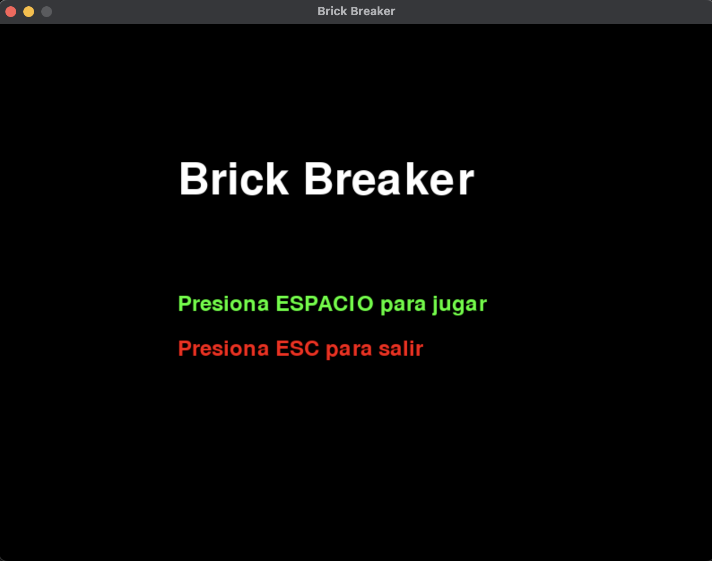
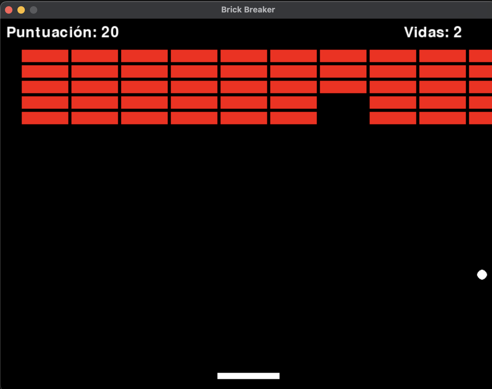

# 🎮 Brick Breaker: ¡El Juego de Romper Ladrillos! 🚀

¡Bienvenido/a al emocionante mundo de **Brick Breaker**, un juego clásico y divertido hecho con **Python** y **PyGame**! 🌟 Controla una paleta para golpear una pelota y romper todos los ladrillos en la pantalla. ¿Listo/a para jugar? 😄

---

## ✨ ¿Qué es Brick Breaker?

En **Brick Breaker**, tu misión es:

- **Mover la paleta** 🏓 usando las flechas izquierda y derecha.
- **Golpear la pelota** ⚽ para que rebote y rompa los ladrillos 🔴.
- **Evitar que la pelota caiga al suelo** 🚫, o perderás una vida ❤️.

Si rompes todos los ladrillos, ¡GANAS! 🎉 Pero si pierdes todas tus vidas, aparecerá una pantalla de "GAME OVER" 😢. No te preocupes, ¡siempre puedes intentarlo de nuevo! 🔁

---

## 🛠️ Características del Juego

- **Menú Principal** 🎯: Comienza el juego o sal cuando quieras.
- **Puntuación** 🏆: Gana puntos cada vez que rompas un ladrillo.
- **Vidas Limitadas** ❤️: Empiezas con 3 vidas. ¡Cuida bien tu pelota!
- **Reinicio Automático** 🔁: Si pierdes, presiona `R` para jugar de nuevo.
- **Gráficos Simples** 🎨: Todo está dibujado con formas geométricas, ¡no necesitas imágenes complicadas!

---

## 🖥️ Requisitos para Jugar

Para jugar a **Brick Breaker**, necesitas lo siguiente:

1. **Python 3.x** 🐍: Descarga Python desde [python.org](https://www.python.org/).
2. **PyGame** 🎮: Instala PyGame escribiendo esto en tu terminal:
   ```
   pip install pygame
   ```

---

## 📂 Estructura del Proyecto

El proyecto está organizado así:

```
brick-breaker/
├── main.py # Aquí está el código mágico del juego 🪄
└── README.md # Este archivo que estás leyendo 📖
```

No necesitas archivos adicionales como imágenes o sonidos, ¡todo está incluido en el código! 🎉

---

## 🎮 Cómo Jugar

1. Descargar el Proyecto 📥:
   Clona o descarga este repositorio en tu computadora.
2. Instalar PyGame 💻:
   Abre una terminal y escribe:

   ```
   pip install pygame
   ```

3. Ejecutar el Juego ▶️:
   En la carpeta del proyecto, ejecuta:

```
python main.py
```

4. Controlar la Paleta 🕹️:
   - Usa las flechas izquierda (←) y derecha (→) para mover la paleta.
   - Golpea la pelota para romper los ladrillos 🔴.
   - ¡No dejes que la pelota toque el suelo! 🚫
   - Reiniciar el Juego 🔁:
   - Si pierdes todas tus vidas, aparecerá una pantalla de "GAME OVER". Presiona R para reiniciar o ESC para salir.

---

## 📸 Capturas de Pantalla

Menú Principal 🎯


Jugando 🎮


GAME OVER 😢


---

## 👩‍💻 Autor

Este proyecto fue creado por Daniela Chamorro 👩‍💻 como parte de un ejercicio divertido de programación en Python. ¡Espero que disfrutes jugando y aprendiendo con este juego!

Si tienes preguntas, sugerencias o simplemente quieres decir "hola", ¡contáctame! 📧

- Email: [dalexach@gmail.com](mailto:dalexach@gmail.com)
- GitHub: [dalexach](https://github.com/dalexach)

---

🌟 ¡Diviértete jugando y aprendiendo a programar! 🚀
¿Sabías que este juego fue hecho con código? 🤔 ¡Tal vez algún día tú también puedas crear tus propios juegos! 🎮✨
